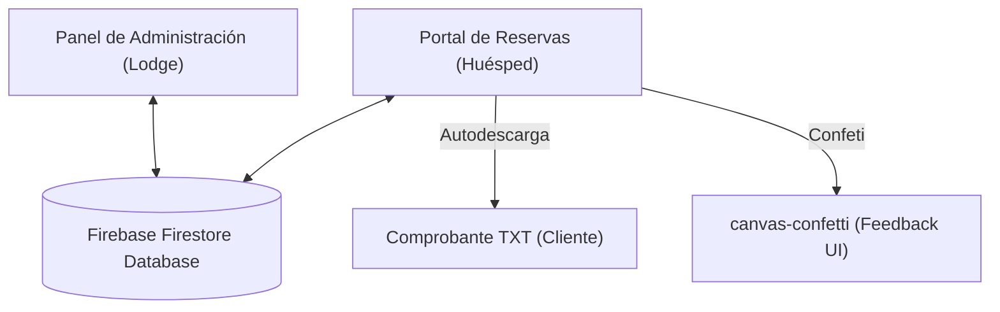
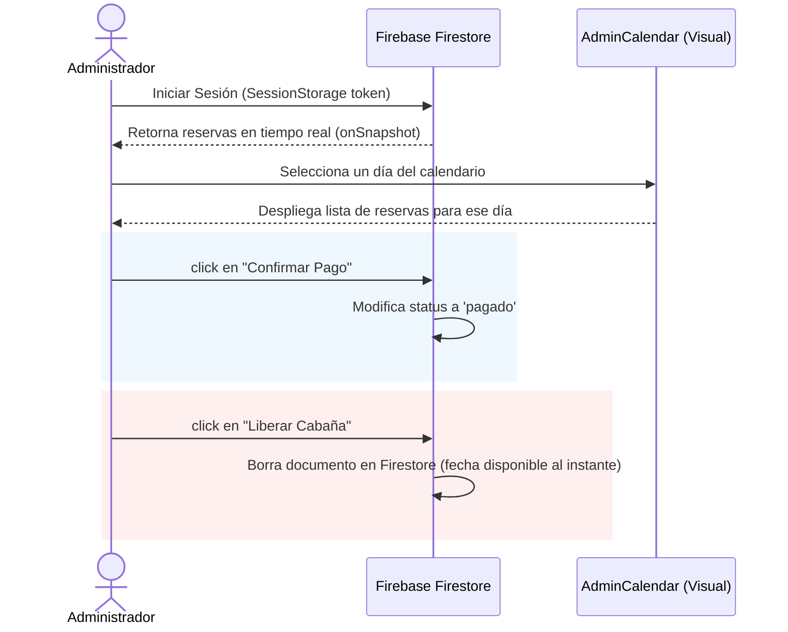

# 🏔️ MANUAL MAESTRO UNIFICADO: LODGE PATAGONIA GO
## Contexto Operativo y Especificación Técnica Completa

Este documento unificado contiene toda la información operativa, de negocio y técnica del sistema **Lodge Patagonia Go**. Está estructurado en dos partes: la **Parte I** está escrita en lenguaje natural (ideal para administradores y equipo de negocio), y la **Parte II** detalla la especificación técnica (ideal para desarrolladores que realicen mejoras en el futuro).

---

# 📖 PARTE I: CONTEXTO FUNCIONAL Y OPERATIVO
*(Para la Administración y el Equipo de Negocio)*

---

## 🧭 1. ¿Qué es Lodge Patagonia Go?

**Lodge Patagonia Go** es un sistema web inteligente de reservas diseñado específicamente para la gestión de alojamientos turísticos en cabañas. El sistema cuenta con dos portales integrados que se comunican entre sí de forma inmediata:

1.  **El Portal del Huésped:** Una página web súper rápida, limpia y optimizada para celulares donde los clientes eligen sus fechas, seleccionan su cabaña favorita y solicitan su reserva en segundos.
2.  **El Panel de Administración:** Una oficina virtual interna donde el equipo del Lodge visualiza la ocupación en un calendario interactivo, confirma pagos y administra qué cabañas están habilitadas para recibir pasajeros.

---

## 🛏️ 2. El Catálogo de Cabañas y sus Experiencias

El Lodge ofrece cuatro tipos de cabañas, cada una orientada a un tipo de huésped y con un mensaje clave que transmite su esencia de descanso y desconexión:

*   **Cabaña Superior (Capacidad: 8 personas):** Enfocada en grupos grandes o familias que buscan la máxima comodidad. Su lema es **"Relajo asegurado"**.
*   **Cabaña Familiar (Capacidad: 5 personas):** Diseñada para una escapada familiar clásica. Su lema es **"Tranquilidad absoluta"**.
*   **Cabaña Bosque (Capacidad: 4 personas):** Ideal para parejas o grupos pequeños que buscan internarse en la naturaleza. Su lema es **"Desconexión total"**.
*   **Cabaña Refugio (Capacidad: 2 personas):** Un rincón íntimo y acogedor, perfecto para parejas. Su lema es **"Paz en la naturaleza"**.

---

## 👤 3. La Experiencia del Cliente: ¿Cómo se hace una reserva?

El proceso de reserva para un huésped se diseñó para ser lo más rápido y libre de frustración posible:

```text
[Elige Fechas en el Calendario] ──> [Elige Tipo de Cabaña] ──> [Rellena sus Datos] ──> [Descarga Comprobante y Confeti]
```

1.  **Selección de Fechas:** El cliente ingresa a la web y ve un calendario mensual en español. Las fechas que ya están reservadas y pagadas por otros clientes aparecen tachadas y en color rojo, por lo que es imposible que ocurra una doble reserva. El cliente hace click sobre los días que desea alojar.
2.  **Selección de Cabaña:** Al hacer click en su cabaña preferida, el sistema le muestra el precio por noche, la capacidad máxima permitida de personas, su lema inspirador y calcula de forma automática el precio total según las noches seleccionadas.
3.  **Formulario de Datos:** Al presionar "Reservar", se despliega un formulario muy sencillo que solicita tres datos clave: *Nombre Completo, Teléfono de contacto y Correo electrónico*.
4.  **Confirmación y Descarga:** Al confirmar la reserva, la pantalla celebra lanzando confeti digital de colores y muestra un mensaje de éxito. De forma automática, **el sistema descarga un archivo de texto en el celular o computador del cliente**. Este archivo funciona como un comprobante inmediato que detalla:
    *   Un código único de reserva.
    *   Las fechas de estadía y la cabaña seleccionada.
    *   Los datos del cliente.
    *   **Instrucciones de Pago:** Los datos de la cuenta bancaria del Lodge para que el cliente realice la transferencia del dinero dentro de las próximas 2 horas para asegurar su cupo.

---

## 🛡️ 4. La Gestión del Lodge: ¿Cómo opera el Administrador?

El panel de administración interno permite al personal del Lodge controlar todo el flujo operativo en tiempo real:

### 4.1 El Calendario de Control Visual
El administrador tiene una vista mensual donde cada día muestra las cabañas que están reservadas ese día. Para facilitar la lectura rápida, el sistema usa un código de colores muy intuitivo:
*   **Color Naranja (Pendiente):** Significa que el cliente completó la reserva en la web, pero el Lodge aún no ha verificado la transferencia bancaria.
*   **Color Verde (Pagado):** Significa que el pago ha sido verificado y la reserva está 100% asegurada.

### 4.2 Acciones de Reserva con un Click
Cuando el administrador selecciona un día específico en su calendario, ve los datos del cliente (nombre, teléfono y correo) y puede realizar dos acciones clave:
1.  **Confirmar Pago:** Al verificar que llegó la transferencia del cliente a la cuenta del Lodge, presiona este botón y la reserva pasa a estado **Pagado (Verde)** al instante.
2.  **Liberar Cabaña:** Si el cliente canceló su viaje o pasaron las 2 horas de plazo sin realizar la transferencia, el administrador presiona este botón. La reserva se elimina del sistema y **las fechas quedan disponibles de inmediato** en la página web pública para que otro cliente las pueda reservar, sin necesidad de actualizar nada.

### 4.3 Control de Inventario (Interruptor de Mantención)
Si una cabaña necesita reparaciones, fumigación o una limpieza profunda imprevista, el administrador tiene interruptores para "apagar" cabañas. Si desactiva una cabaña en su panel, esta desaparecerá de las opciones elegibles en la web pública de inmediato, evitando que los huéspedes agenden días en una cabaña que no está en condiciones óptimas.

---

## ⚡ 5. La Magia del Tiempo Real (Sin Tecnicismos)

Una de las mayores virtudes de esta aplicación es que funciona en **tiempo real absoluto**. 
Esto significa que no hay botones de "recargar" o "actualizar". Si un cliente reserva una cabaña desde su celular en Santiago, esa cabaña aparecerá como bloqueada en la pantalla de otra persona que esté cotizando desde Concepción en el mismo segundo. Lo mismo ocurre cuando el administrador libera una fecha: se desbloquea al instante en las pantallas de todos los usuarios conectados a la web. Esto elimina las posibilidades de sobreventa y le da un aspecto sumamente moderno e interactivo al negocio.

---

## 📈 6. Plan de Ruta para Mejoras Futuras (Visión de Negocios)

Para llevar el negocio al siguiente nivel, la plataforma está estructurada para crecer fácilmente en las siguientes áreas de valor:

### A. Automatización del Recaudo (Pagos Online)
*   **Cómo funciona hoy:** El cliente reserva y hace una transferencia manual. El Lodge tiene que revisar la cuenta corriente del banco y marcar la reserva como pagada manualmente.
*   **Cómo mejorarlo:** Conectar la web con plataformas como **Webpay Plus (Transbank), Flow o Mercado Pago**. El cliente pagaría con su tarjeta de crédito o débito directamente en la web y, al ser exitoso, el sistema marcaría la reserva como **Pagada (Verde)** de manera automática, sin intervención humana.

### B. Notificaciones de Fidelización (WhatsApp)
*   **Cómo funciona hoy:** El cliente recibe un correo electrónico o descarga su comprobante en texto.
*   **Cómo mejorarlo:** Conectar el sistema a una API de envío de mensajes de WhatsApp. Al momento de reservar, el cliente recibiría un mensaje automático y profesional en su celular diciendo: *"¡Hola Juan! Hemos recibido tu solicitud para la Cabaña Superior del 20 al 25 de Enero. Recuerda realizar tu transferencia para asegurar tu estadía."*

### C. Gestión de Tarifas Dinámicas (Temporada Alta / Baja)
*   **Cómo funciona hoy:** Los precios de las cabañas son fijos.
*   **Cómo mejorarlo:** Añadir una sección en el panel de administración que le permita al Lodge cambiar los precios por noche de las cabañas según el mes del año, permitiendo cobrar tarifas de temporada alta en verano o feriados, y tarifas promocionales de temporada baja de forma ágil.

---

# 💻 PARTE II: ESPECIFICACIÓN TÉCNICA Y ARQUITECTURA
*(Para Desarrolladores e Ingenieros)*

---

## 🗺️ 1. Arquitectura y Stack Tecnológico

La aplicación se construyó con un enfoque moderno de alto rendimiento en el frontend, acoplado con una base de datos en tiempo real de baja latencia para evitar sobreventas y asegurar consistencia instantánea.



### Stack de Tecnologías
*   **Framework:** Next.js (Versión 16+ con App Router y renderizado de componentes de cliente reactivos).
*   **Lenguaje:** TypeScript para tipado estricto y estabilidad del software.
*   **Estilos:** Tailwind CSS (v4) con custom variables globales para la paleta de colores del Lodge (ej. `var(--forest-green)`).
*   **Base de Datos:** Firebase Firestore para almacenamiento y sincronización reactiva bidireccional en tiempo real.
*   **Manejo de Fechas:** date-fns con localización en español para el cálculo de intervalos de reserva y formateos.
*   **Animaciones:** Framer Motion para transiciones fluidas de pop-ups y elementos de la interfaz.

---

## 📁 2. Estructura de Directorios

La organización del código sigue la convención estándar del App Router de Next.js:

```text
LODGE/
├── src/
│   ├── app/
│   │   ├── admin/
│   │   │   └── page.tsx        # Panel de Administración de Reservas y Disponibilidad
│   │   ├── globals.css         # Estilos globales y variables de diseño
│   │   ├── layout.tsx          # Layout principal (fuente, metadatos SEO)
│   │   └── page.tsx            # Portal del Cliente (Home - Selector e información)
│   ├── components/
│   │   ├── ActionFooter.tsx    # Resumen inferior de precios y botón de reservar
│   │   ├── AdminCalendar.tsx   # Calendario interactivo especializado para administración
│   │   ├── CabinSelector.tsx   # Visualizador de tarjetas de cabañas y sus detalles
│   │   ├── Calendar.tsx        # Calendario de reserva multi-fecha para huéspedes
│   │   └── Header.tsx          # Cabecera / Navbar responsiva
│   └── lib/
│       └── firebase.ts         # Inicialización segura y exportación de Firebase Firestore
├── public/                     # Recursos estáticos (Logos, imágenes)
├── package.json                # Dependencias y scripts de ejecución
└── tsconfig.json               # Configuración de compilación de TypeScript
```

---

## 🗄️ 3. Modelo de Datos y Base de Datos (Firestore)

El sistema opera con dos colecciones principales en **Cloud Firestore**. 

### 3.1 Colección: `bookings` (Reservas)
Cada documento representa el agendamiento de una cabaña para un conjunto específico de fechas.

| Campo | Tipo | Descripción |
| :--- | :--- | :--- |
| `id` | `string` | ID auto-generado por Firestore. |
| `cabinId` | `string` | ID de la cabaña asociada (`c8`, `c5`, `c4`, `c2`). |
| `customerName` | `string` | Nombre completo del huésped. |
| `customerPhone` | `string` | Número telefónico de contacto (+56...). |
| `customerEmail` | `string` | Correo electrónico de contacto. |
| `dates` | `array (string)` | Lista ordenada de fechas reservadas en formato ISO (`YYYY-MM-DD...`). |
| `startDate` | `string` | Fecha de llegada (Check-in) en formato ISO. |
| `endDate` | `string` | Fecha de salida (Check-out) en formato ISO. |
| `totalPrice` | `number` | Precio total cobrado por la estancia completa. |
| `status` | `string` | Estado del pago (`confirmed` para reserva web inicial, `pagado` tras confirmación admin). |
| `createdAt` | `string` | Timestamp de creación en formato ISO. |

### 3.2 Colección: `cabins` (Cabañas)
Almacena el estado y configuración de cada cabaña física disponible para reserva.

| Campo | Tipo | Descripción |
| :--- | :--- | :--- |
| `id` | `string` | Clave única de cabaña (`c8`, `c5`, `c4`, `c2`). |
| `name` | `string` | Nombre visible del inmueble. |
| `price` | `number` | Tarifa diaria / precio por noche (CLP). |
| `available` | `boolean` | Interruptor administrativo general para habilitar/deshabilitar reservas. |

> [!NOTE]
> **Sembrado de Datos Automático:** Si la colección `cabins` está vacía en Firestore al iniciar el Panel de Admin, la función `syncCabins` inicializará los datos automáticamente con los precios estándar preconfigurados (`CABINS_INITIAL`).

---

## 💻 4. Desglose de Componentes del Portal del Cliente

### 4.1 `src/app/page.tsx`
Es la página principal del cliente que actúa como orquestador de estado.
*   **Manejo de Estado Principal:**
    *   `selectedDates`: Array de objetos tipo `Date` seleccionados por el usuario.
    *   `selectedCabinId`: ID de la cabaña activa.
    *   `blockedDates`: Array dinámico de fechas bloqueadas por reservas previas de esa cabaña.
*   **Optimizaciones Clave:**
    *   **Envío UI Instantáneo:** La función `submitBooking` realiza la escritura en Firestore en segundo plano (background thread sin bloquear con `await`). Muestra inmediatamente la ventana de confirmación y confeti al usuario para crear una experiencia de velocidad inigualable.
    *   **Generador Automático de Comprobante:** Al reservar, la aplicación compila un archivo de texto formateado (`.txt`) con los datos de transferencia bancaria, crea un `Blob` nativo en el navegador y gatilla una descarga automática invisible para el usuario.

### 4.2 `src/components/CabinSelector.tsx`
Visualiza las cabañas disponibles en un formato Bento Grid.
*   **Efecto Responsivo:** En móviles, tiene un comportamiento `snap-x` horizontal que permite deslizar cabañas con gestos naturales del dedo. En pantallas grandes (LG en adelante), se transforma automáticamente a un formato vertical estructurado.
*   **Textos de Marketing Integrados:** Se configuraron textos emocionales de relajo debajo del nombre de cada cabaña:
    *   Cabaña Superior: `"Relajo asegurado"`
    *   Cabaña Familiar: `"Tranquilidad absoluta"`
    *   Cabaña Bosque: `"Desconexión total"`
    *   Cabaña Refugio: `"Paz en la naturaleza"`

### 4.3 `src/components/Calendar.tsx`
El motor de selección de fechas.
*   **Selección Múltiple:** Utiliza `date-fns` para iterar y pintar las grillas mensuales dinámicamente.
*   **Seguridad:** Valida en tiempo real que el usuario no pueda hacer click en fechas pasadas a hoy (`isBefore(day, today)`) ni en fechas contenidas dentro del arreglo reactivo de `blockedDates`.
*   **Visualización:** Las celdas bloqueadas se muestran tachadas y en color rojo tenue.

---

## 🛡️ 5. Desglose del Panel de Administración

Ubicado en la ruta [src/app/admin/page.tsx](file:///c:/Users/oragn/Downloads/LODGE/src/app/admin/page.tsx), es un sistema robusto de gestión interna.



### 5.1 Autenticación
*   Implementada por motivos de velocidad y simplicidad usando un login de sesión persistido en `sessionStorage` (`lodge_admin_auth`).
*   Credencial de administrador: `contacto@lodgepatagonia.cl`

### 5.2 Controladores de Reservas
*   **Confirmación de Pago:** Permite cambiar el estado de la reserva de `confirmed` (pendiente) a `pagado` con un solo click. Esto cambia el color del indicador en el calendario a verde esmeralda.
*   **Liberar Cabaña:** Borra físicamente el registro de la reserva de Firestore. Al estar atado a sockets y listeners de tiempo real (`onSnapshot`), las fechas correspondientes en el portal del cliente se liberan **al milisegundo**, sin necesidad de recargar la página.

### 5.3 Interruptores de Disponibilidad de Cabañas (Kill-switch)
*   En la barra lateral derecha/inferior, el administrador puede forzar el apagado manual de cualquier cabaña. Esto modifica la propiedad `available` en Firestore, quitándola del flujo de reservas de manera temporal si se requiere hacer mantención o limpieza profunda.

---

## 🔄 6. Flujos Críticos de Datos

### 6.1 Flujo de Sincronización de Fechas Bloqueadas
El flujo reactivo que asegura que dos usuarios no reserven la misma cabaña simultáneamente:

```text
[Cliente selecciona Cabaña X]
       │
       ▼
[Gatilla useEffect en page.tsx]
       │
       ▼
[onSnapshot lee 'bookings' donde cabinId == X]
       │
       ▼
[Parsea rangos/arrays de 'dates' en formato Date]
       │
       ▼
[Actualiza estado local 'blockedDates']
       │
       ▼
[Calendar.tsx bloquea visualmente y deshabilita inputs para esos días]
```

---

## 🚀 7. Guía Práctica de Futuras Mejoras

Si necesitas expandir la plataforma en el futuro, aquí tienes una guía directa de implementación paso a paso para las mejoras más comunes:

### 7.1 Integración de Pasarela de Pago (ej. Webpay Plus / Transbank / Stripe)
Actualmente, el portal genera un comprobante con instrucciones de transferencia manual. Para automatizar pagos con tarjeta:
1.  **Instalación del SDK:** Instala el cliente oficial de transbank o stripe:
    ```bash
    npm install transbank-sdk
    ```
2.  **Ruta de API de Transacción:** Crea una API Route en Next.js (`src/app/api/pay/route.ts`) que genere la transacción enviando el precio total de la cabaña seleccionada.
3.  **Redirección:** Modifica `submitBooking` en `page.tsx` para que en vez de mostrar éxito de inmediato, redirija al usuario a la URL de pago de Transbank.
4.  **Confirmación:** Al completarse exitosamente la transacción en la pasarela de pago, actualiza el estado de la reserva de `confirmed` a `pagado` automáticamente en Firestore utilizando un Webhook.

### 7.2 Notificaciones Automáticas por WhatsApp (ej. Twilio API)
Para avisar al administrador o confirmar automáticamente al cliente vía WhatsApp:
1.  **Crear un webhook / API route:** (`src/app/api/whatsapp/route.ts`).
2.  **Conexión Twilio:** Configura Twilio API con tu número telefónico Sandbox o cuenta verificada.
3.  **Llamada desde el Formulario:** En `submitBooking`, realiza un fetch a tu ruta de API enviando el número del cliente y la cabaña reservada:
    ```typescript
    fetch('/api/whatsapp', {
      method: 'POST',
      body: JSON.stringify({ phone: formData.phone, msg: '¡Tu cabaña está lista!' })
    });
    ```

### 7.3 Autenticación de Administradores con Firebase Auth
Si deseas cambiar el login simple actual por cuentas reales e individuales de administración con contraseñas seguras y encriptadas:
1.  Activa **Email/Password Provider** en tu consola de Firebase Auth.
2.  Importa el módulo `auth` creado en `src/lib/firebase.ts`.
3.  Modifica el formulario de login de `src/app/admin/page.tsx` para usar `signInWithEmailAndPassword`:
    ```typescript
    import { signInWithEmailAndPassword } from 'firebase/auth';
    import { auth } from '@/lib/firebase';

    // Dentro del login
    await signInWithEmailAndPassword(auth, username, password);
    ```
4.  Usa el hook `onAuthStateChanged` para verificar si hay una sesión activa de forma segura.

---

*Este documento maestro representa la base operativa y técnica unificada de Lodge Patagonia Go. Mantenlo actualizado ante cada cambio en el ecosistema.*
